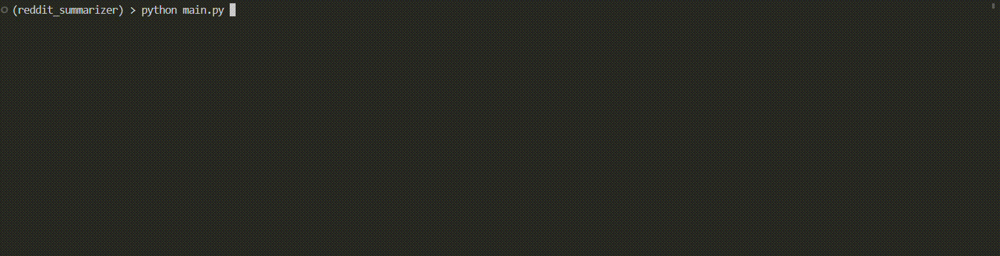
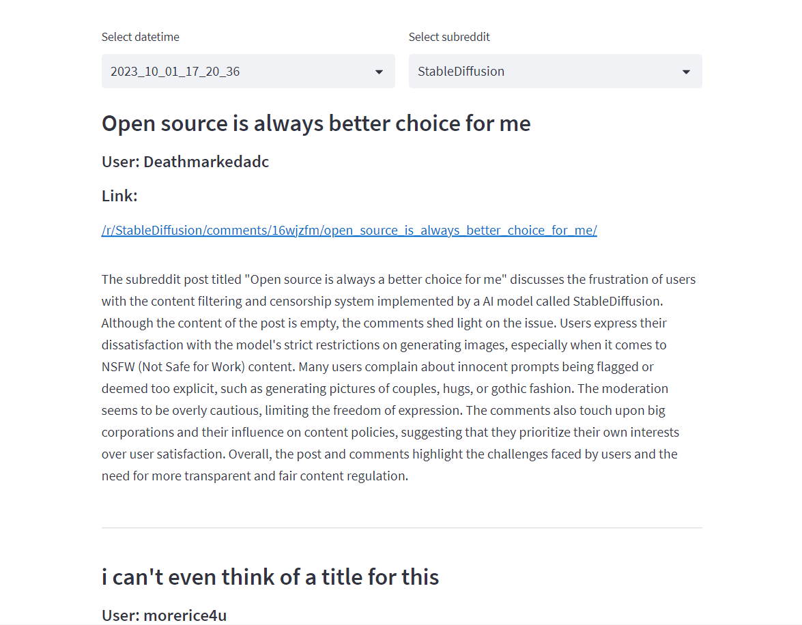

## Overview

`reddit_summarizer` summarizes subreddit posts using OpenAI GPT 3.5.

## Usage

First, clone this repository into your system.

```bash
git clone https://github.com/outday29/reddit_summarizer
```

Install necessary dependencies

```bash
pip install -r requirements.txt
```

Create `.env` in the top directory. Define the following settings:

```
PERSONAL_USE_SCRIPT="your_reddit_use_script"
CLIENT_SECRET="your_reddit_client_secret"
USER_AGENT="your_reddit_user_agent"
USERNAME="your_reddit_username"
PASSWORD="your_reddit_pwd"
OPENAI_KEY="your_openai_key" # Used for querying gpt-3.5 turbo
```

Then specify what subreddits to summarize by configuring `interest.yaml` (You can look at the example). You can also specify what comments to keep or filtered out during summarization.

Below is the explanation for each field:

```yaml
subreddits: 
# Define a list of settting objects, each specifies one subreddit
  - name: ChatGPT # What is the name of the subreddit to scrape?
    posts: 
    # Define a list of post-specific rules to select which posts in the subreddit to summarize.
    # Any post that satisfies any of the rules will be included.
    - limit: 5 # Number of posts to select at most
      recency: 7 # Only select posts that are created less than 7 days ago
      num_comments: 10 # Minimum number of comments the posts need to have
      upvote_ratio: 0.5 # Minimum upvote_ratio for the post to be selected
      votes: 100 # Minimum amount of upvotes posts should have
    comments:
    # For selected posts, specify how should we filter the comments. 
      comments_top: 10 # Select the top 10 comments
      comment_min_votes: 100 # Minimum number of upvotes comments should have.
      reply_min_votes: 5 # How many upvotes a reply should have to be selected
      max_replies: 5 # Maximum number of replies to be selected for each depth level.
      max_replies_level: 2 # Only select nested replies (replies to reply) of depth of 2. Reply to comments has depth of 1. In this case, we only select reply to comments + the repiesy to replies to comments.
```

Then run the following command to scrape and summarize the subreddits defined just now.

```
python main.py
```



By default, the scraped subreddit posts and summary generated by GPT 3.5 will be stored in `filtered` and `report` respectively.

You may then view the summary in a nice Streamlit UI.

```
streamlit run report.py
```



## Limitations
- Currently the script does not work well for submission/post that contains external links (such as reference link to article) or non-text contents (such as images and GIFs)
- Some prompt engineering may be needed. Prefix prompts can be found in `prompts.txt`
